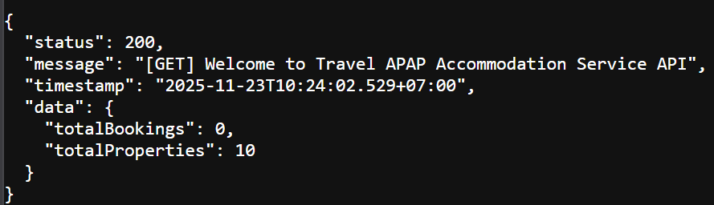
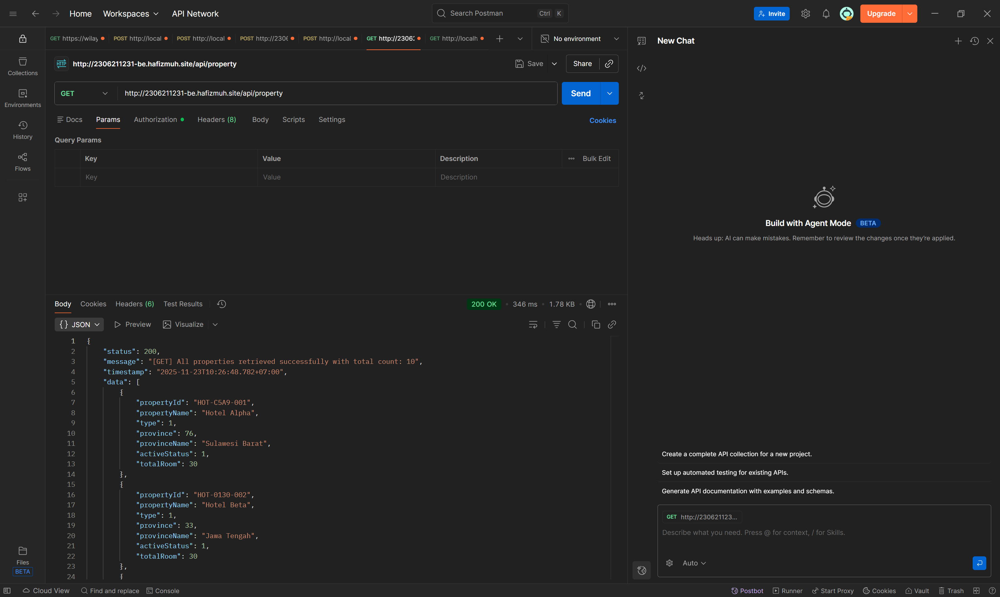
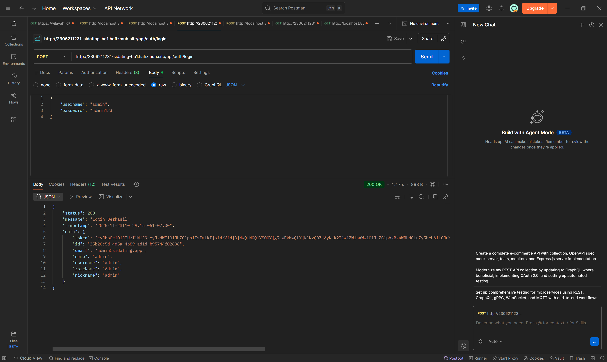
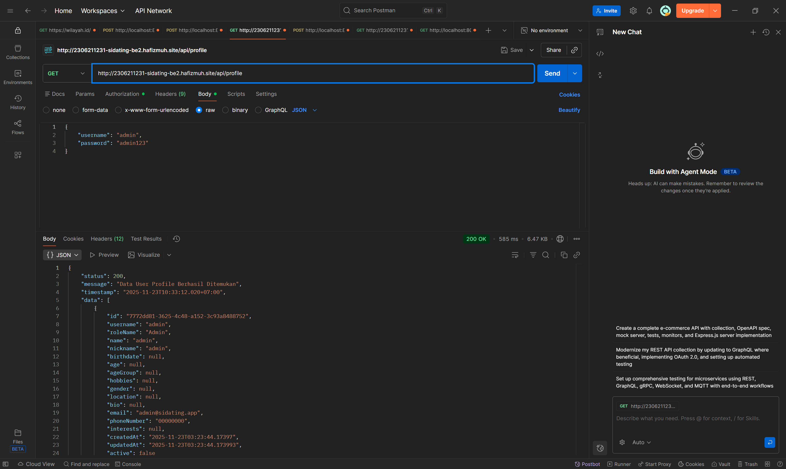
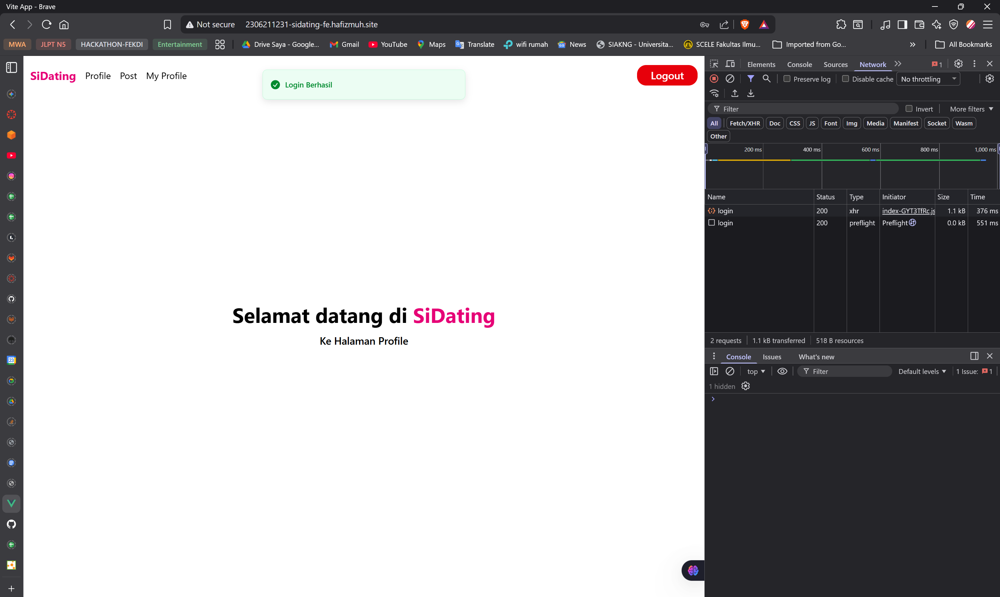

**Jawaban Tugas (Soal 2 - 11)**

1. **Deployment Result**

**Hasil Deploy (TI):**

[[GET] Accommodation App BE root (/api)](http://2306211231-be.hafizmuh.site)

[[GET] Accommodation App BE GET All Properties (/property)](http://2306211231-be.hafizmuh.site/property)

**Hasil Deploy (Sidating):**

[[POST] Sidating App Login: Admin (/api/auth/login)](http://2306211231-sidating-be1.hafizmuh.site/api/auth/login)

[[GET] Sidating App Get Profile](http://2306211231-sidating-be1.hafizmuh.site/api/profile)

[[POST] Sidating App 2 Login: Admin (/api/auth/login)](http://2306211231-sidating-be2.hafizmuh.site/api/auth/login)

[[GET] Sidating App 2 Get Profile](http://2306211231-sidating-be2.hafizmuh.site/api/profile)

[[GET] Cross to Sidating App 2 Get Profile](http://2306211231-sidating-be2.hafizmuh.site/api/auth/login)

[[GET] Cross to Sidating App 1 Get Profile](http://2306211231-sidating-be1.hafizmuh.site/api/profile)

[[POST] Login in Frontend](http://2306211231-sidating-fe.hafizmuh.site/login)

2. **Deskripsi Pipeline CI/CD saya (gambaran):**
	- Gambaran singkat (ilustrasi struktur pipeline):

	```text
	|
	|___build
	|___docker-push
	|___deploy
	```

	- Penjelasan singkat tiap stage:
		- **build:** Menjalankan `./gradlew clean build -x test`, menghasilkan `app.jar` dan artefak build.
		- **docker-push:** Membangun image Docker menggunakan `Dockerfile` (multi-stage), menandai image dengan tag commit, lalu mem-push ke registry.
		- **deploy:** Membuat `ConfigMap` & `Secret` dari secret/variabel CI, mengganti tag image di `k8s/deployment.yaml`, menyalin manifest ke server EC2, lalu menerapkan manifest ke k3s dan menunggu rollout selesai.

3. **Usulan Improvement CI/CD:**
- **Jalankan test & quality gate:** Aktifkan unit/integration test di pipeline serta static analysis (SpotBugs, Checkstyle, Sonar) sebelum membangun image.
- **Caching & artifact reuse:** Gunakan cache build (Gradle cache) dan artifacts agar pipeline lebih cepat.
- **Image scanning & SBOM:** Lakukan vulnerability scanning (Trivy) dan hasilkan SBOM sebelum push.
- **Blue/Green atau Canary:** Implementasi deployment bertahap (canary/rolling) untuk mengurangi risiko produksi.
- **Templating & GitOps:** Gunakan Helm/Kustomize dan GitOps (ArgoCD/Flux) untuk pengelolaan manifest lebih baik, serta secret management (Vault/Secrets Manager).

4. **Mengapa mengaitkan EC2 dengan Elastic IP?**
- **Alasan:** Elastic IP memberikan alamat publik statis sehingga hostname/DNS tetap mengarah ke server meskipun instance di-stop/started.
- **Jika tidak menggunakan Elastic IP:** IP publik EC2 bisa berubah saat instance stop/start sehingga DNS/ingress/akses ke cluster menjadi tidak stabil dan perlu update manual.

5. **Perbedaan utama Docker vs Kubernetes pada praktikum ini:**
- **Docker (container runtime):** Menjalankan single container pada satu host; cocok untuk development dan testing lokal.
- **Kubernetes (orchestrator):** Mengatur banyak container/pod, menyediakan scaling, load balancing, service discovery, rolling updates, dan self-healing.
- **Intinya:** Docker membungkus aplikasi; Kubernetes mengelola lifecycle & availability aplikasi di cluster.

6. **Proses paling penting dalam pipeline dan kenapa:**
- **Build + Test (quality gate):** Menjalankan build dan test merupakan tahap paling krusial karena mencegah bug dari masuk ke image/production. Tanpa kualitas yang divalidasi, deployment otomatis bisa menyebarkan kerusakan.

7. **Fungsi 5 file Kubernetes yang digunakan:**
- `k8s/deployment.yaml` : Mendefinisikan `Deployment` (jumlah replika, container image, env vars) dan mengatur rolling update.
- `k8s/service.yaml` : Menyediakan akses internal ke `Pods` melalui `Service` (di sini tipe `ClusterIP`).
- `k8s/ingress.yaml` : Mengatur aturan HTTP(S) eksternal (host/path) dan meneruskan traffic ke `Service` melalui Ingress controller (Traefik pada contoh).
- `configmap.yaml` (dibuat di CI): Menyimpan konfigurasi non-rahasia (mis. `DATABASE_URL_PROD_1`, `DATABASE_USERNAME`) yang disuntikkan ke Pod.
- `secret.yaml` (dibuat di CI): Menyimpan data rahasia (mis. `DATABASE_PASSWORD`, `JWT_SECRET_KEY`, `CORS_ALLOWED_ORIGINS`) yang dipakai sebagai env vars dalam Pod.

8. **Start/Restart behavior yang diterapkan dan bagaimana:**
- **Kubernetes (k3s) menangani restart:** `k3s` (systemd) menjaga control plane dan kubelet aktif; `Deployment` memastikan `Pods` yang mati akan direcreate (self-healing).
- **Perbedaan Docker standalone:** Pada Docker biasa perlu mengatur `--restart` policy; pada Kubernetes, restart otomatis dan reconcilation dikelola oleh controller (Deployment/ReplicaSet).

9. **Keuntungan memakai Kubernetes dibanding langsung run Docker image di server:**
- **High availability & self-healing:** Pods yang gagal otomatis dipulihkan.
- **Scaling & load balancing:** Mudah menambah replika dan menyebarkan trafik.
- **Declarative infra:** Definisi infrastruktur tersimpan dalam manifest yang bisa versioned.
- **Rolling updates & rollbacks:** Deployment zero-downtime lebih mudah.
- **Service discovery & konfigurasi terpusat:** `Service`, `ConfigMap`, dan `Secret` memudahkan pengelolaan konfigurasi.

10. **Perbedaan tipe Service (ClusterIP, NodePort, LoadBalancer) dan alasan memilih ClusterIP untuk praktikum:**
- **ClusterIP:** Layanan hanya dapat diakses dari dalam cluster (default). Cocok bila akses ke aplikasi melalui `Ingress`.
- **NodePort:** Mengekspos service pada port statis di setiap node; berguna untuk akses langsung ke node tanpa load balancer.
- **LoadBalancer:** Membuat load balancer eksternal (cloud provider) dan menghubungkannya ke service; tidak selalu tersedia di lingkungan on-prem/k3s tanpa penyedia LB eksternal.
- **Mengapa `ClusterIP` dipilih:** Praktikum menggunakan `Ingress` (Traefik) untuk routing eksternal, sehingga service internal `ClusterIP` sudah cukup dan lebih aman serta sederhana untuk lab/single-node k3s.

11. **Pelajaran terpenting & penerapan CI/CD pada proyek lain:**
- **Pelajaran:** Otomatisasi membuat deploy lebih cepat, dapat direproduksi, dan mengurangi human error; tetapi penting menambahkan quality gates (test/scan) sebelum deploy.
- **Penerapan di proyek lain:** Terapkan pipeline serupa (build → test → image → push → deploy), sertakan tes otomatis, monitoring, dan strategi deployment aman (canary/rolling). Gunakan IaC/manifest terversioning dan integrasikan secret management.
